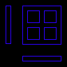
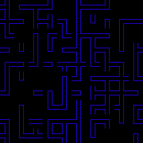
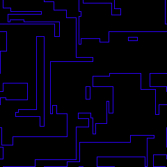
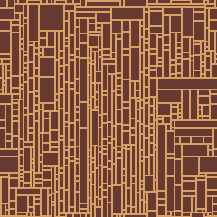
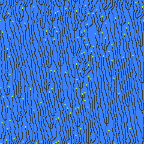

# Wave Function Collapse 画像自動生成サンプル

* `WangTiles`、`Wave Function Collapse (WFC)` の`OverlappingModel`を簡易的に実装したサンプルになります。
    * Wang Tilesに沿って事前に用意したパターンから、WFCでは入力画像からパターン抽出し、画像を生成します。

#### Wang Tiles
* 隣り合う辺の色・ラベルが一致するようにタイルのコピーを並べるという概念
* 用意するタイルパターンについては下記論文で紹介されている並びで用意しています。
    * [Tile-Based Texture Mapping on Graphics Hardware](https://graphics.stanford.edu/papers/tile_mapping_gh2004/)

| ファイル名 | 入力画像 | 画像サイズ | 出力画像 | 画像サイズ |
| -- | -- | -- | -- | -- |
| tile_patterns.png |  | 96x96 |  | 240x240 |

#### Wave Function Collapse (WFC)
    * タイルマップ画像を入力として、パターンを選択して新たな画像を生成するアルゴリズム
    * OverlappingModelを簡易的に実装しており、画像のパターン抽出も自動で行います。
        * 入力画像から3x3のパターンを自動抽出し、上下左右方向で隣接ルールを定義しています。
        * 回転や斜め方向の隣接ルールは用意していません。

| ファイル名 | 入力画像 | 画像サイズ | 出力画像 | 画像サイズ |
| -- | -- | -- | -- | -- |
| tile_patterns.png |  | 96x96 |  | 240x240 |
| road_small.png |  | 24x24 |  | 240x240 |
| wakame.png |  | 15x24 |  | 240x240 |


## 実行環境

* Pythonバージョン
    * 3.10.6
        * 3系なら基本的に実行できると思います。
* 使用パッケージ
    * pillow
        * 下記コマンドでインストールを行ってください。
        ```
        # 直接インストールする場合
        pip install pillow

        # requirements.txtからインストールする場合
        pip install -r requirements.txt
        ```

## 実行方法

1. 各Pythonファイルのmain関数内の定義を変更して入力画像などのパラメータを設定してください。
2. 下記コマンドでそれぞれ実行すると画像が生成されます。
    ```
    // Wang Tilesによる生成の場合
    python ./wang_tiles_random.py

    // WFC OverlappingModel による生成の場合
    python ./wfc_overlapping_model.py
    ```
